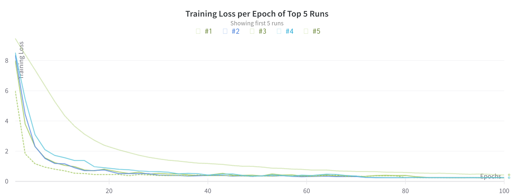
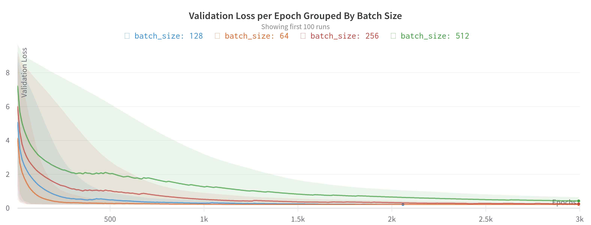
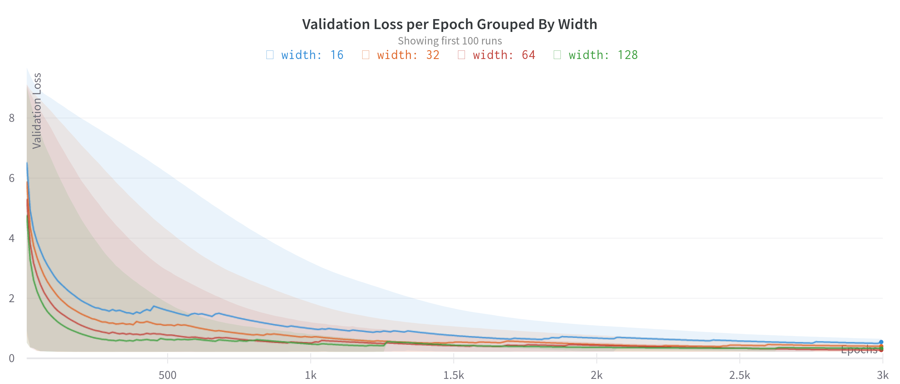
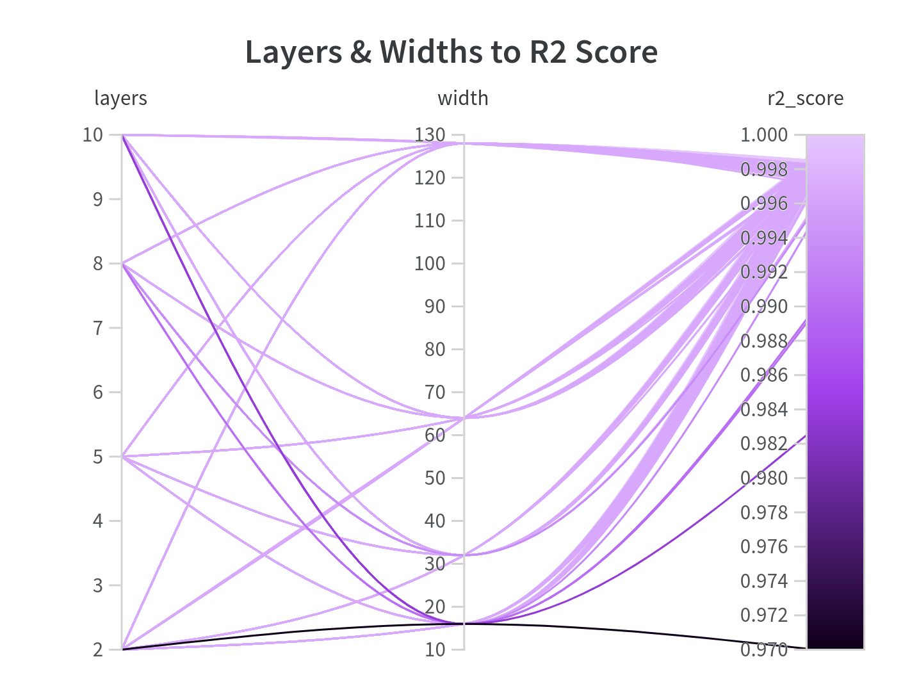
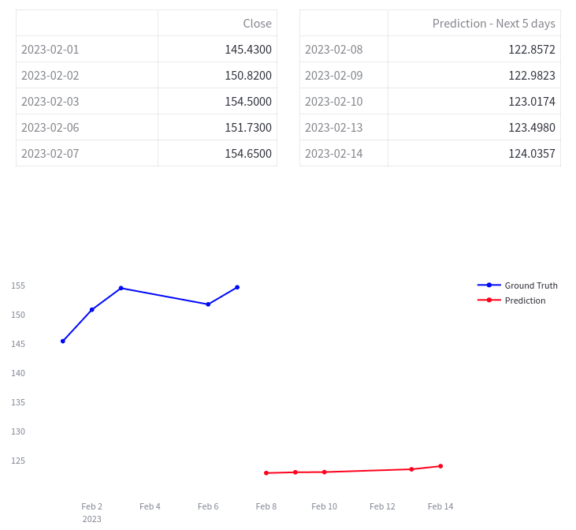

## Stock Market Analysis

This is a simple regression/forecasting problem on finance data from **Yahoo! Finance** (https://finance.yahoo.com).
The architecture is based on Residual MLP and make predictions based on historical finance data.

## Project tree

```
.
├── data
│   └── AAPL.csv
├── inference
│   ├── 5_days_forecast.csv
│   ├── Dockerfile
│   ├── predictor.py
│   ├── requirements.txt
│   ├── run.py
│   ├── start.sh
│   ├── streamlit_dash.py
│   └── utils.py
├── license.md
├── models
├── notebooks
│   └── experimentation.ipynb
├── readme.md
├── reports
│   └── figures
│       ├── architecture.png
│       ├── layers_widths_to_r2_score.png
│       ├── streamlit.png
│       ├── training_loss_per_epoch_of_top_5_runs.png
│       ├── validation_loss_per_epoch_grouped_by_batch_size.png
│       └── validation_loss_per_epoch_grouped_by_width.png
├── requirements.txt
├── src
│   ├── config.json
│   ├── main.py
│   ├── models
│   │   ├── net.py
│   │   └── train.py
│   └── utils
│       └── early_stopping.py
└── wandb
```

## Dependencies

```shell
pip install -r requirements.txt
```

## Data

The dataset contains daily prices of **AAPL**'s stock from 02-01-1981 to 31-12-2020 with a total of **10088 records** (https://finance.yahoo.com/quote/AAPL/history?p=AAPL). You are free to download data for any ticker and place it in **data/**. 

| Date       | Open     | High     | Low      | Close    | Adj Close | Volume   |
|------------|----------|----------|----------|----------|-----------|----------|
| 1981-01-02 | 0.154018 | 0.155134 | 0.154018 | 0.154018 | 0.119849  | 21660800 |
| 1981-01-05 | 0.151228 | 0.151228 | 0.15067  | 0.15067  | 0.117244  | 35728000 |
| 1981-01-06 | 0.144531 | 0.144531 | 0.143973 | 0.143973 | 0.112032  | 45158400 |
| 1981-01-07 | 0.138393 | 0.138393 | 0.137835 | 0.137835 | 0.107256  | 55686400 |

## Architecture

The input to the algorithm is a feature vector containing the prices of 5-days and the output is a 5-days forecasting. The architecture is based on a Multi-Layer Perceptron with Residual blocks ([reports/figures/architecture.png](reports/figures/architecture.png)).

```text
input type:  float32[batch_size, features]
output type: float32[batch_size, features]
```

```python
class ResLayer(torch.nn.Module):
    def __init__(self, in_units, width):

        super(ResLayer, self).__init__()
        self.linear = torch.nn.Linear(width, width)
        self.layer_norm = torch.nn.LayerNorm(in_units)

    def forward(self, x):

        out = self.layer_norm(x)
        out = torch.nn.functional.relu(out)
        out = self.linear(out)

        return x + out


def make_network(input_dim=5, width=64, L=2, out_features=5):

    network = torch.nn.Sequential(
        torch.nn.Linear(input_dim, width),
        *[ResLayer(width, width) for _ in range(L)],
        torch.nn.LayerNorm(width),
        torch.nn.Linear(width, out_features))
```

## Training

To start the training process, change sweep-grid.yml according to your preferences and start wandb sweep agents.

```bash
wandb agent username/project-name/sweep-id
```

The default yaml configuration for hyper-parameter searching is the following:

```yaml
metric:
  goal: minimize
  name: epoch_validation_loss
parameters:
  batch_size:
    values: [64, 128, 256, 512]
  learning_rate:
    values: [1e-4, 1e-3, 1e-2]
  width:
    values: [16, 32, 64, 128]
  layers:
    values: [2, 5, 8, 10]
```

Or, if you want a single run, edit [config.json](src/config.json) and run:

```python
python src/main.py
```

The training/validation results can be found in the figures below.
The visualization results were grouped together by width or batch size because there were 192 different runs (7 hours runtime on NVIDIA GeForce RTX 3060). 









All the models, after training, can be found in [models/*.onnx](models/). The best model according to R2 Score (~0.99) and Validation Loss was found to be [net_64_0.001_128_10.onnx](models/net_64_0.001_128_10.onnx) (batch_size=64, learning_rate=0.001, width=128, n_layers=10).

The training logs of the best model can be found below.
```
Epoch 0   Training Loss: 7.99902   Validation Loss: 4.92759   Test-set R2 score 0.31796018820369887
Epoch 10   Training Loss: 0.62362   Validation Loss: 0.35983   Test-set R2 score 0.991991435884876
Epoch 20   Training Loss: 0.53284   Validation Loss: 0.53004   Test-set R2 score 0.9977522046063891
Epoch 30   Training Loss: 0.42422   Validation Loss: 0.40238   Test-set R2 score 0.9984710738171296
Epoch 40   Training Loss: 0.25176   Validation Loss: 0.23936   Test-set R2 score 0.9985934214650122
Epoch 50   Training Loss: 0.24619   Validation Loss: 0.23402   Test-set R2 score 0.9984343994916177
Epoch 60   Training Loss: 0.24483   Validation Loss: 0.23705   Test-set R2 score 0.998505054349778
Epoch 70   Training Loss: 0.24009   Validation Loss: 0.23141   Test-set R2 score 0.9986534208850506
Epoch 80   Training Loss: 0.23945   Validation Loss: 0.23220   Test-set R2 score 0.9987220776242743
Epoch 90   Training Loss: 0.23824   Validation Loss: 0.23115   Test-set R2 score 0.998675443642089
Epoch 100   Training Loss: 0.24081   Validation Loss: 0.23093   Test-set R2 score 0.9986685500944951
Epoch 110   Training Loss: 0.24033   Validation Loss: 0.23093   Test-set R2 score 0.9986685938685038
Epoch 120   Training Loss: 0.23980   Validation Loss: 0.23093   Test-set R2 score 0.9986684999524955
Epoch 130   Training Loss: 0.23925   Validation Loss: 0.23093   Test-set R2 score 0.9986686177959229
Epoch 140   Training Loss: 0.24114   Validation Loss: 0.23093   Test-set R2 score 0.9986686122659989
Epoch 150   Training Loss: 0.24129   Validation Loss: 0.23093   Test-set R2 score 0.9986686039168189
---------------------------------------------------------------------------------------------------
Epoch 150   Training Loss: 0.24129   Validation Loss: 0.23093   Test-set R2 score 0.9986686039168189
```

## Inference

Inference mode is running when new data are available. The scheduler runs once per hour and fetches any new prices. 
For visualizations, the streamlit (https://streamlit.io) library was used.

To run in inference mode, gather data and start forecasting, first fill the cookies & headers in [inference/run.py](inference/run.py#L57-L58) to make requests to yahoo possible. Then:

```bash
cd inference/
```

```docker
docker build -t app .
docker run -d --name app -p 8501:8501 {IMAGEID}
```

Docker will inititiate the scheduler and the predictor and will expose the streamlit dashboard to **0.0.0.0:8501**.


